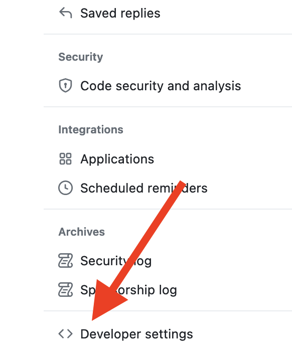
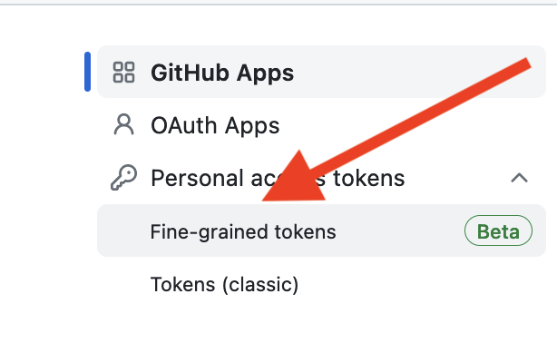
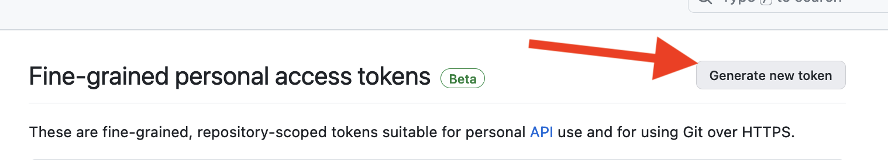
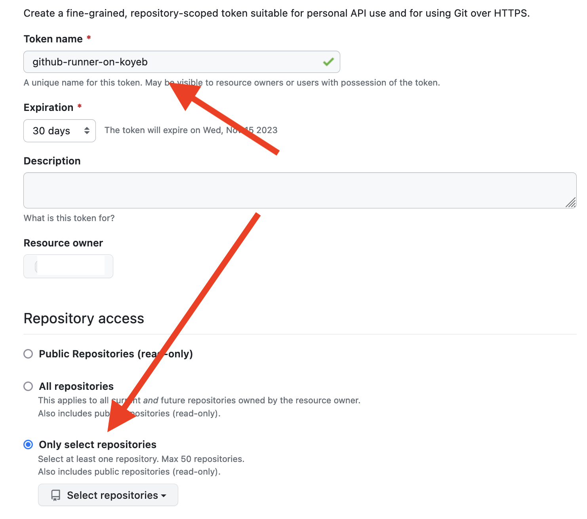
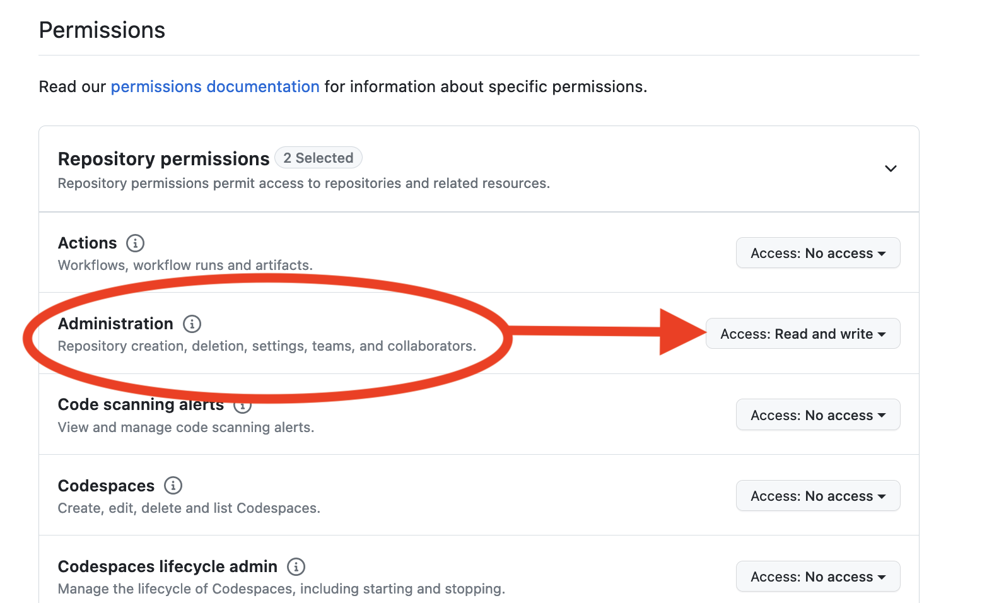
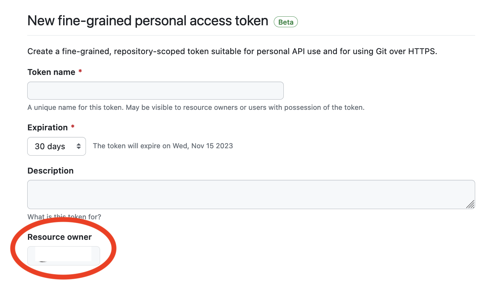
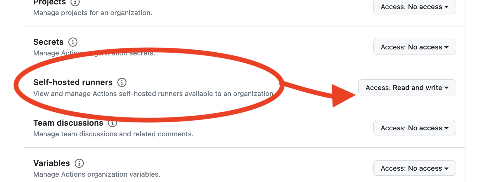

# `koyeb-github-runner`

The **koyeb-github-runner** repository contains the source code for the [`koyeb/github-runner` Docker image](https://hub.docker.com/r/koyeb/github-runner/), which allows you to set up a GitHub runner on the Koyeb platform.

## Overview

By default, GitHub actions are run by shared runners hosted on GitHub. These runners are free, but due do their shared nature, they can be slow and have limited resources. To overcome these limitations, we've created a GitHub runner that can be deployed on Koyeb.

To fully understand how this this runner works, there are some key concepts you should be aware of. If you are already familiar with GitHub runners, you can skip this section and go directly to the [Usage](#usage) section below.

### Repository or Organization Runner?

GitHub offers two options to register a runner: for a specific repository or for an entire organization.

If you want to set up a runner for more than one repository, first [create a new organization](https://github.com/organizations/plan) and move your repositories to it. Then, follow the instructions below to [register a runner for your organization](#for-an-organization).

*Note: it is not possible to register a runner for your personal organization.*

### Runner labels

The `runs-on` directive in your job file allows you to specify the label of the runner that should execute the job.

For example, consider the following workflow file:

```yaml
on:
  push:
    branches:
      - '*'

jobs:
  docker:
    runs-on: koyeb-runner
    container: alpine
    steps:
      - name: Say hello
        run: |
          echo "Hello world!"
```

This action will be executed by a runner with the `koyeb-runner` label. You need to match the `runs-on` value in your job file with the `RUNNER_LABELS` environment variable of your runner. See the section on [creating the Koyeb Application and Service](#create-the-koyeb-application-and-service) for more information.

### Requirements

To use this runner, you need:

- A Koyeb account.
- (Optional) the [Koyeb CLI](https://www.koyeb.com/docs/build-and-deploy/cli/installation) installed and configured. Make sure you have the latest version installed. 

## Usage

To configure the Koyeb GitHub runner, you need to complete the following steps:

1. [Create a GitHub token](#1-create-a-github-token)
2. [Create the Koyeb Application and Service](#2-create-the-koyeb-application-and-service)

### 1. Create a GitHub token

#### For a repository

If you want to register a runner for a specific repository, visit the [Developer Settings](https://github.com/settings/tokens?type=beta) of your account settings:



Under the "Fine-grained tokens" section, click [Generate new token](https://github.com/settings/personal-access-tokens/new):




Set the token name and expiration, choose "Only select repositories", and select the repository you wish to configure:



In the "Permissions" section, select "Read & Write" access for the "Administration" item:



#### For an organization

If you want to register a runner for your organization, visit the [Developer Settings](https://github.com/settings/tokens?type=beta) of your account settings:


Under the "Fine-grained tokens" section, click [Generate new token](https://github.com/settings/personal-access-tokens/new):


Set the token name and expiration, and select your organization under "Resource owner", and choose "All repositories" under the access settings:



Select your organization and in the "Organization Permissions" section, select "Read & Write" access for "Self-hosted runners":



### 2. Create the Koyeb Application and Service

#### With the `koyeb` CLI

If your favorite way to interact with Koyeb is the CLI, follow these steps.

First, create a new application:

```sh
koyeb app create github-runner
```

Then, create a new service:

```sh
koyeb service create \
   --type worker \
   --docker koyeb/github-runner \
   --env REPO_URL=https://github.com/<OWNER>/<REPO> \
   --env GITHUB_TOKEN=xxx \
   --env RUNNER_LABELS=koyeb-runner \
   --region par \
   --instance-type medium \
   --privileged \
   --app github-runner \
   runner
```

Make sure to replace the following values:

| Variable name | Value |
|---------------|-------|
| **REPO_URL** | the URL of your repository (`https://github.com/<OWNER>/<REPO>`) or the URL of your organization (`https://github.com/<ORG>`)
| **GITHUB_TOKEN** | the token you created in the previous step
| **RUNNER_LABELS** | must match the `runs-on` directive of your job file

If you don't need to start a Docker daemon to run your jobs, you can disable it by setting `--env DISABLE_DOCKER_DAEMON=true` and removing the `--privileged` flag.

#### With the control panel

If you prefer using the control panel, follow these steps:

1. Create a new Docker project
2. Use the image `koyeb/github-runner`
3. Select the "Worker" service type
4. Set the "privileged" flag
5. Set the following environment variables:

| Variable name | Value |
|---------------|-------|
| **REPO_URL** | the URL of your repository (`https://github.com/<OWNER>/<REPO>`) or the URL of your organization (`https://github.com/<ORG>`)
| **GITHUB_TOKEN** | the token you created in the previous step
| **RUNNER_LABELS** | must match the `runs-on` directive of your job file

If you don't need to start a Docker daemon to run your jobs, you can disable it by setting a `DISABLE_DOCKER_DAEMON` environment variable to `true`.  In this case, you can also remove the "privileged" flag.

## Advanced usage

### `koyeb-github-runner-scheduler`

To start GitHub runners on-demand, consider using [`koyeb-github-runner-scheduler`](https://github.com/koyeb/koyeb-github-runner-scheduler). This project allows you to start GitHub runners on a schedule and stop them when they are not needed, saving you money.

## Contributing

The image is inspired by the default GitHub runner images available at [GitHub Actions runner-images](https://github.com/actions/runner-images).

We are actively working on this project, so if you have feedback (whether this project is working for you or not), we would **love** to hear from you on our [Slack channel](https://slack.koyeb.com/).
